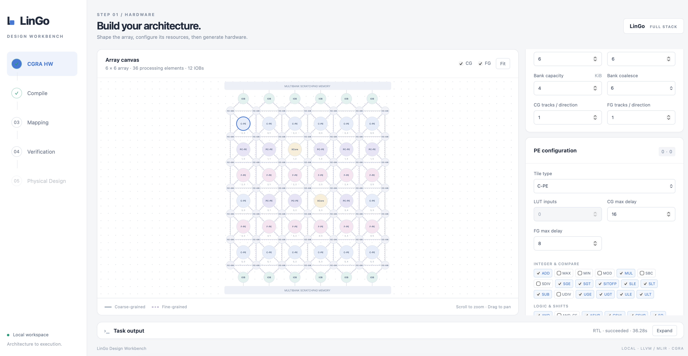
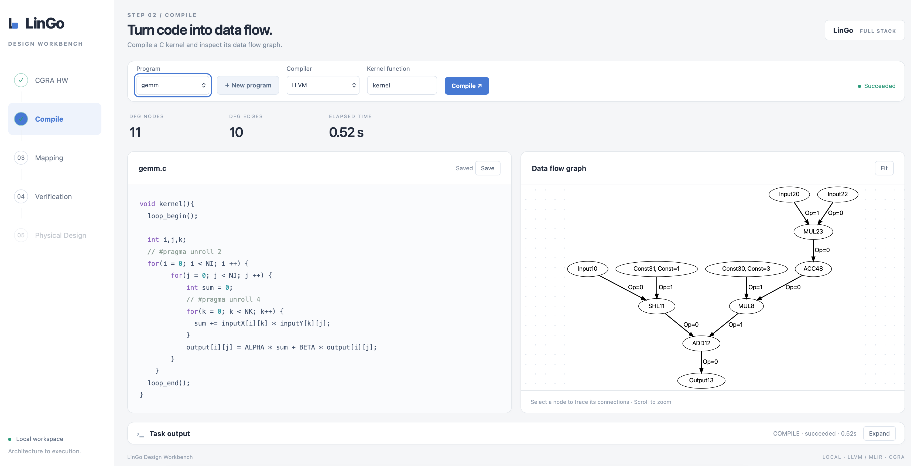
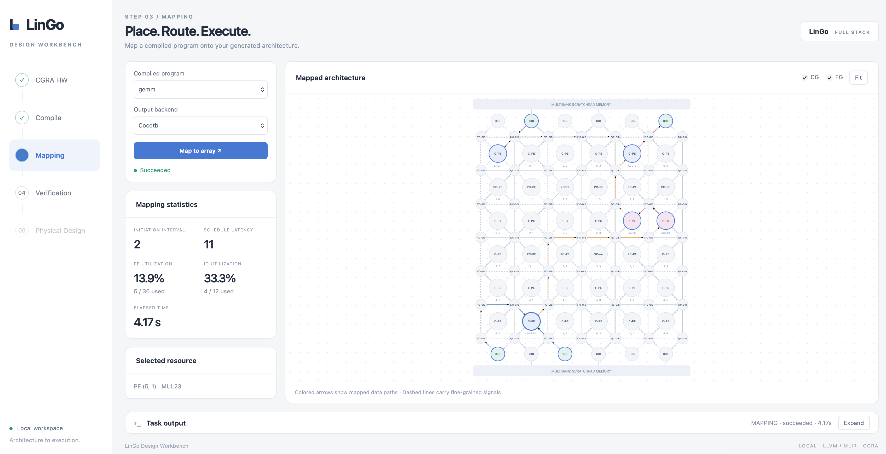
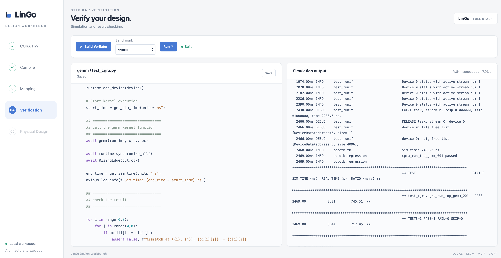

# LinGo

## Preparation

1. Install LLVM 15.0.6

```
cd LinGo

curl -L -O https://github.com/llvm/llvm-project/releases/download/llvmorg-15.0.6/llvm-project-15.0.6.src.tar.xz

mkdir -p llvm-project
tar -xf llvm-project-15.0.6.src.tar.xz \
    -C llvm-project \
    --strip-components=1

cmake -G Ninja \
    -S llvm-project/llvm \
    -B llvm-project/build \
    -DCMAKE_BUILD_TYPE=Release \
    -DLLVM_ENABLE_DUMP=ON \
    -DLLVM_TARGETS_TO_BUILD=X86 \
    -DCMAKE_INSTALL_PREFIX="$(pwd)/llvm-project/install" \
    -DLLVM_ENABLE_PROJECTS="clang"

ninja -C llvm-project/build -j 16
ninja -C llvm-project/build install
```

2. Conda env

```
conda create -n lingo python=3.12
conda activate lingo
conda install -c conda-forge openjdk=8 --no-update-deps
conda install -c conda-forge sbt --no-update-deps
pip install "cocotb~=1.9.2"
pip install cocotbext-axi
pip install numpy
```


3. Yosys download

```
curl -L -O https://github.com/YosysHQ/oss-cad-suite-build/releases/download/2026-10-02/oss-cad-suite-linux-x64-20261002.tgz

mkdir -p oss-cad-suite

tar -xf oss-cad-suite-linux-x64-20261002.tgz \
    -C oss-cad-suite \
    --strip-components=1
```

4. Install Verilator 5.044, and add to bashrc

```
git clone https://github.com/verilator/verilator.git
cd verilator
git checkout v5.044
autoconf
./configure
make -j8
export PATH=xxx/verilator/bin:$PATH
```

5. [Optional] MLIR Compiler support: Polygeist and LLVM18

```
git clone https://github.com/llvm/Polygeist.git
cd Polygeist
git submodule update --init --recursive --progress
cd llvm-project
cmake -G Ninja \
    -S llvm \
    -B build \
    -DCMAKE_BUILD_TYPE=Release \
    -DLLVM_ENABLE_DUMP=ON \
    -DLLVM_ENABLE_ASSERTIONS=ON \
    -DLLVM_ENABLE_RTTI=ON \
    -DLLVM_ENABLE_LIBEDIT=OFF \
    -DLLVM_TARGETS_TO_BUILD=X86 \
    -DLLVM_ENABLE_PROJECTS="clang;mlir" \
    -DCMAKE_INSTALL_PREFIX="$(pwd)/install"

ninja -C build -j 16
ninja -C build install

cd ..
mkdir build
cd build

make -G Ninja .. \
    -DMLIR_DIR=$PWD/../llvm-project/build/lib/cmake/mlir \
    -DCLANG_DIR=$PWD/../llvm-project/build/lib/cmake/clang \
    -DLLVM_TARGETS_TO_BUILD="host" \
    -DLLVM_ENABLE_ASSERTIONS=ON \
    -DCMAKE_BUILD_TYPE=DEBUG

ninja -j 16

```


## Build 

1. Build compiler

```
cd ./compiler
bash build.sh
```

2. Build mapper

```
cd ./mapper
bash build.sh
```

3. [Optional] Build MLIR compiler ADORA

```
cd LinGo
export ADORA_LLVM_ROOT="$(pwd)/Polygeist/llvm-project/install"
cd adora
cmake -S . -B build -G Ninja \
  -DCMAKE_BUILD_TYPE=Release \
  -DMLIR_DIR="$ADORA_LLVM_ROOT/lib/cmake/mlir" \
  -DLLVM_DIR="$ADORA_LLVM_ROOT/lib/cmake/llvm"

cmake --build adora/build --target cgra-opt cgrv-opt adora-cdfg -j8
```

## Run

1. RTL hardware generate

```
cd ./hardware
conda activate lingo
bash genRTL.sh
bash export-cocotb.sh
```

2. Compile app

```
cd ./benchmarks
cd [example]
../compile.sh [example] [kernel]
cd .. && ./dot2json.sh
```

3. Mapping

```
cd ./mapper
../run.sh [example] cocotb
cp ../benchmarks/[example]/xxx_cocotb.py ../simulation/workspace/[example].py
```

4. Verfication

```
cd simulation
conda activate lingo
export PYTHONPATH=$(pwd)/server:$PYTHONPATH
export PYTHONPATH=$(pwd)/workspace:$PYTHONPATH
make [-j8]
```

## [Experimental] GUI flow

```
python3 LinGo/gui/server.py --port 8080
```

then visit localhost:8080








